# ASP.NET Core 6 使用 Token-based 身份認證與授權 (JWT) 演練

* [1. 前言](#1-前言)  
* [2. 開發環境](#2-開發環境)  
* [3. 實作過程](#3-實作過程)  
  * [3.1 初始化專案](#31-初始化專案)  
  * [3.2 撰寫 JWT 相關功能 (JwtHelpers)(LoginController), 及受保護的 API 資源(JwtController)](#32-撰寫-jwt-相關功能-jwthelperslogincontroller-及受保護的-api-資源jwtcontroller)  
  * [3.3 加入服務註冊及 Middleware 設定](#33-加入服務註冊及-middleware-設定)  
  * [3.4 小測一下, 確認可以取得 JWT token](#34-小測一下-確認可以取得-jwt-token)
* [4. 完整測試截圖](#4-完整測試截圖)  
  * [4.1 Postman 測試截圖](#41-postman-測試截圖)  
  * [4.2 Postman 環境設定](#42-postman-環境設定)
* [5. 參考文件](#5-參考文件)  

## 1. 前言
本文主要參考 <a href="https://blog.miniasp.com/post/2022/02/13/How-to-use-JWT-token-based-auth-in-aspnet-core-60" target="_blank">(Will保哥) 如何在 ASP.NET Core 6 使用 Token-based 身份認證與授權 (JWT)</a> 的文章為基礎作演練.  
保哥的文章是以 Minimal API + .NET CLI + Visual Studio Code 為基礎.  
筆者的演練係以 Controller/Action API + Visual Studo 2022 為演練的對象; 過程中有遇到一些錯誤, 也一併記錄下來 (有些可能蠻低級的錯誤 ^^), 以供筆者或其它有興趣者留作參考.  
本文僅處理產出 JWT access token 及驗證為範圍, 不含 JWT refresh token, 登出 的功能.    

## 2. 開發環境
* Windows 10 22H2 Home Edition  
* Visual Studio 2022  

## 3. 實作過程

### 3.1 初始化專案

(1) 以 Visual Studio 2022 建立不採用 Minimal API 的 ASP.NET Core Web API 專案. 留意下圖的選項.  
* [x] 使用控制器, 而非 Minimal API
* [x] 啟用 Open Api (Swagger) 支援  
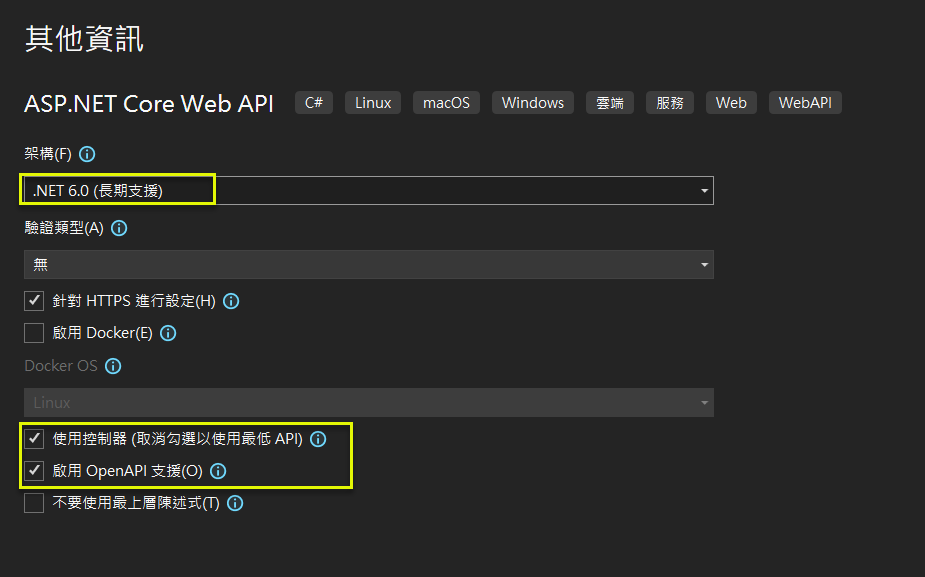

(2) 加入至版控  
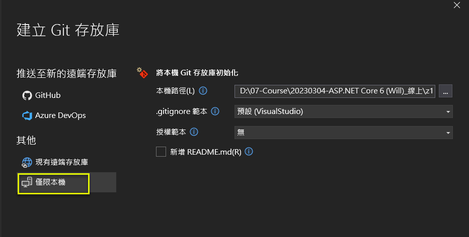

(3) 加入 Nuget 套件 ( Microsoft.AspNetCore.Authentication.JwtBearer ) 
* ASP.NET Core middleware that enables an application to receive an OpenID Connect bearer token. (bearer : 承載者)    
* 因為選擇 .NET 6, 所以相關的版本, 也要選支援 .NET 6 的.  
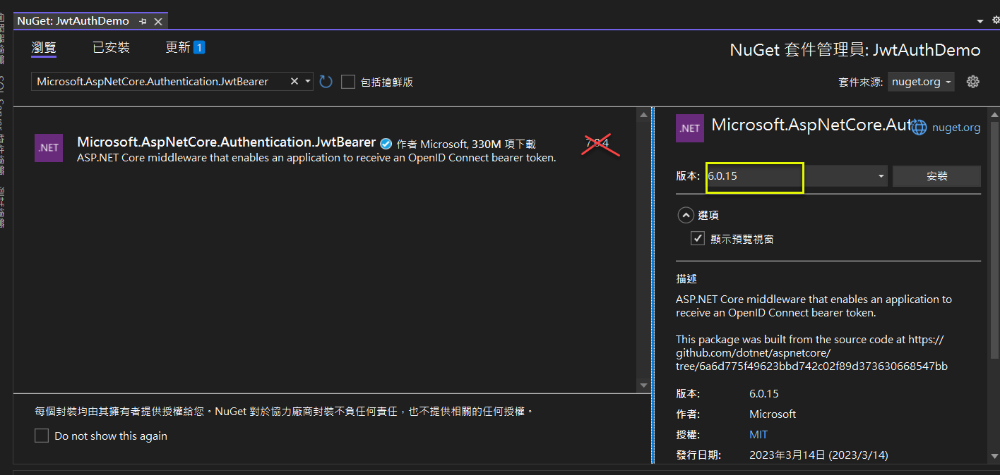  

(4) 確定可以運作 (in Swagger UI) 
<a href="https://localhost:7155/swagger/index.html" target="_blank">https://localhost:7155/swagger/index.html</a>  
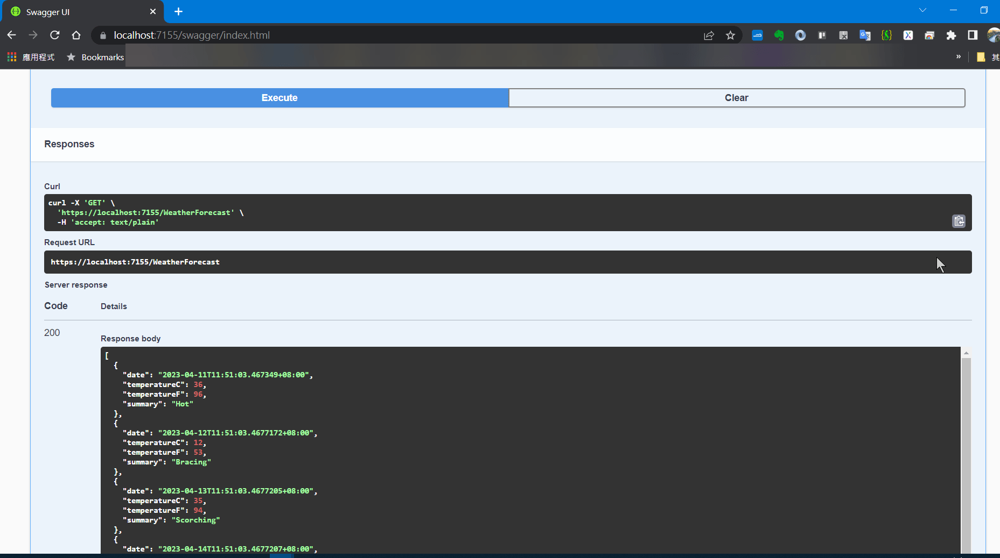

(5) 確定可以運作 (in Postman) 
<a href="https://localhost:7155/WeatherForecast" target="_blank">https://localhost:7155/WeatherForecast</a>  
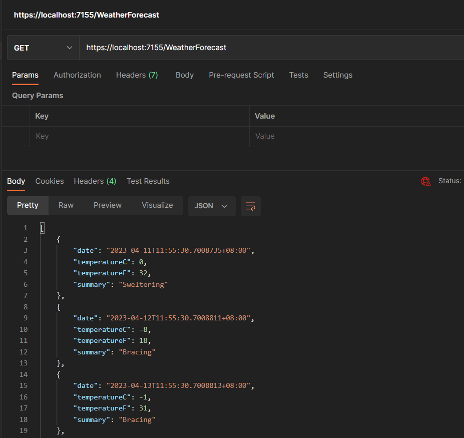

### 3.2 撰寫 JWT 相關功能 (JwtHelpers)(LoginController), 及受保護的 API 資源(JwtController)

(1) 加入 JwtHelpers 輔助類別   
請直接參考下載的程式碼.  

(2) 修訂 appsettings.json 組態設定  
主要是 JwtSettings 這段, 可與前述 JwtHelpers 類別作比對.
```json
{
  "JwtSettings": {
    "Issuer": "JwtAuthDemo",
    "SignKey": "1Zl4h9703IzROikK3@uK&&OEb"
  },  
  "Logging": {
    "LogLevel": {
      "Default": "Information",
      "Microsoft.AspNetCore": "Warning"
    }
  },
  "AllowedHosts": "*"
}
```
```csharp
var issuer = Configuration.GetValue<string>("JwtSettings:Issuer");
var signKey = Configuration.GetValue<string>("JwtSettings:SignKey");
```

(3) 將 JwtHelpers 類別註冊進 .NET 的 DI 容器中  
```csharp
builder.Services.AddSingleton<JwtHelpers>();    // Add JwtHelpers to DI
```

(4) 加入一個 LoginViewModel 模型類別 (用來登入時的模型繫結)  
```csharp
namespace JwtAuthDemo.ViewModels
{
    public record LoginViewModel
    {
        public string UserName { get; init; }
        public string Password { get; init; }

        public LoginViewModel(string username, string password) => 
            (UserName, Password) = (username, password);
    }
}
```

(5) 加入 LoginController (這個是登入成功後, 取得對應的 JWT token)   
**注意:** 必須是 API 控製器, 而不是 MVC 的 !  
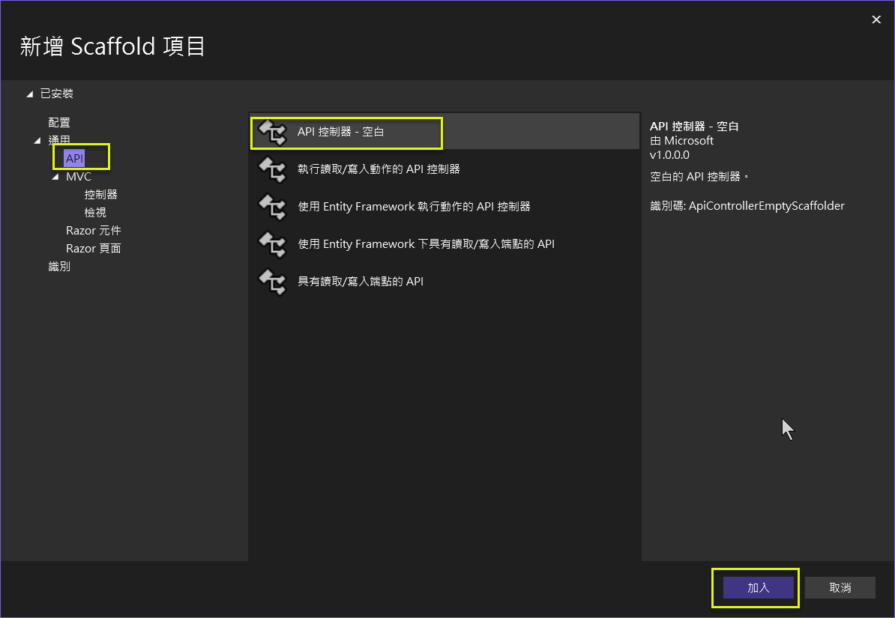  
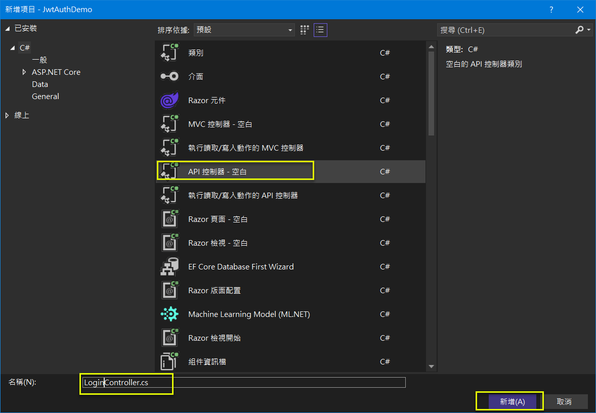  
```csharp
namespace JwtAuthDemo.Controllers
{
    using Microsoft.AspNetCore.Http;
    using Microsoft.AspNetCore.Mvc;

    [Route("api/[controller]")]
    [ApiController]
    public class LoginController : ControllerBase
    {
    }
}
```

(6) 實作 LoginController 的 SignIn action   
**注意:** action 的回傳值可以是 IResult (in Microsoft.AspNetCore.Http), 或 IActionResult (in  Microsoft.AspNetCore.Http); 以下是採用 IActionResult 作為回傳.  
```csharp
private bool ValidateUser(LoginViewModel login)
{
    return true;
}

/// <summary>
/// 登入並取得 JWT Token
/// </summary>
/// <param name="login"></param>
/// <param name="jwt"></param>
/// <returns></returns>
//[HttpPost(Name = nameof(SignIn))]
[HttpPost(Name = "signin")]
public IActionResult SignIn(LoginViewModel login, JwtHelpers jwt)
{
    if (ValidateUser(login))
    {
        var token = jwt.GenerateToken(login.UserName);
        return Ok(new { token });
    }
    else
    {
        return BadRequest();
    }
}
```

(7) 加入 JwtController (這個是受保護的資源), 並實作一些 actions   

**注意:** 整個 JwtController 都是受保護的資源, 所以 Authorize attribute 是放在 Controller 層級.

```csharp
using Microsoft.AspNetCore.Authorization;

namespace JwtAuthDemo.Controllers
{
    using Microsoft.AspNetCore.Http;
    using Microsoft.AspNetCore.Mvc;
    using System.Security.Claims;
    using System.Xml.Linq;

    [Route("api/[controller]")]
    [ApiController]
    [Authorize]
    public class JwtController : ControllerBase
    {
        /// <summary>
        /// 取得 JWT Token 中的所有 Claims
        /// </summary>
        /// <param name="user"></param>
        /// <returns></returns>
        //[HttpGet(Name = nameof(GetClaims))]
        [HttpGet(Name = "claims")]
        public IActionResult GetClaims(ClaimsPrincipal user)
        {
            return Ok(user.Claims.Select(p => new { p.Type, p.Value }));
        }

        /// <summary>
        /// 取得 JWT Token 中的使用者名稱
        /// </summary>
        /// <param name="user"></param>
        /// <returns></returns>
        [HttpGet(Name = "username")]
        public IActionResult GetUserName(ClaimsPrincipal user)
        {
            return Ok(user.Identity?.Name); 
        }

        /// <summary>
        /// 取得使用者是否擁有特定角色
        /// </summary>
        /// <param name="user"></param>
        /// <param name="name"></param>
        /// <returns></returns>
        [HttpGet(Name = "isInRole")]
        public IActionResult IsInRole(ClaimsPrincipal user, string name)
        {
            return Ok(user.IsInRole(name));
        }

        /// <summary>
        /// 取得 JWT Token 中的 JWT ID
        /// </summary>
        /// <param name="user"></param>
        /// <returns></returns>
        [HttpGet(Name = "jwtid")]
        public IActionResult GetJwtId(ClaimsPrincipal user)
        {
            return Ok(user.Claims.FirstOrDefault(p => p.Type == "jti")?.Value);
        }
    }
}
```

### 3.3 加入服務註冊及 Middleware 設定

ASP.NET Core 要能夠認得使用者傳入的 Bearer Token, 這部分需要加入身份認證的服務宣告, 也要加入 Middleware 設定.  

(1) 將身份認證及授權, 加入至 DI container (Add Authentication and Authorization to DI container)  
這裡不但要加入 AddAuthentication(JwtBearerDefaults.AuthenticationScheme), 也要加入 AddAuthorization()  
```csharp
builder.Services
    .AddAuthentication(JwtBearerDefaults.AuthenticationScheme)
    .AddJwtBearer(options =>
    {
        // 當驗證失敗時，回應標頭會包含 WWW-Authenticate 標頭，這裡會顯示失敗的詳細錯誤原因
        options.IncludeErrorDetails = true; // 預設值為 true，有時會特別關閉

        options.TokenValidationParameters = new TokenValidationParameters
        {
            // 透過這項宣告，就可以從 "sub" 取值並設定給 User.Identity.Name
            NameClaimType = "http://schemas.xmlsoap.org/ws/2005/05/identity/claims/nameidentifier",
            // 透過這項宣告，就可以從 "roles" 取值，並可讓 [Authorize] 判斷角色
            RoleClaimType = "http://schemas.microsoft.com/ws/2008/06/identity/claims/role",

            // 一般我們都會驗證 Issuer
            ValidateIssuer = true,
            ValidIssuer = builder.Configuration.GetValue<string>("JwtSettings:Issuer"),

            // 通常不太需要驗證 Audience
            ValidateAudience = false,
            //ValidAudience = "JwtAuthDemo", // 不驗證就不需要填寫

            // 一般我們都會驗證 Token 的有效期間
            ValidateLifetime = true,

            // 如果 Token 中包含 key 才需要驗證，一般都只有簽章而已
            ValidateIssuerSigningKey = false,

            // "1234567890123456" 應該從 IConfiguration 取得
            IssuerSigningKey = new SymmetricSecurityKey(Encoding.UTF8.GetBytes(builder.Configuration.GetValue<string>("JwtSettings:SignKey")))
        };
    });

builder.Services.AddAuthorization();
```

(2) 加入身份認證與授權的 Middleware 宣告  
```csharp
app.UseAuthentication();
app.UseAuthorization();
```

### 3.4 小測一下, 確認可以取得 JWT token 

執行後, 立刻出現 unhandled exception.

(1) 表示 reqeust body 只應對應到 1 個參數.  
經檢查, jwt 可以用建構式注入 (constructor injection), 而不需在屬注入 (property injection).  
```plaintext
Unhandled exception. System.InvalidOperationException: Action 'JwtAuthDemo.Controllers.LoginController.SignIn (JwtAuthDemo)' has more than one parameter that was specified or inferred as bound from request body. Only one parameter per action may be bound from body. Inspect the following parameters, and use 'FromQueryAttribute' to specify bound from query, 'FromRouteAttribute' to specify bound from route, and 'FromBodyAttribute' for parameters to be bound from body:
* LoginViewModel login
* JwtHelpers jwt
```
```csharp
private JwtHelpers _jwt;
public LoginController(JwtHelpers jwt)
{   
    _jwt = jwt;
}
```

(2) 出現 route 的錯誤.  
經檢查, 係 action 上的 route name 給錯方式了 (不是用 Name="..."), 要作調整
```plaintext
fail: Microsoft.AspNetCore.Diagnostics.DeveloperExceptionPageMiddleware[1]
      An unhandled exception has occurred while executing the request.
      Swashbuckle.AspNetCore.SwaggerGen.SwaggerGeneratorException: Conflicting method/path combination "GET api/Jwt" for actions - JwtAuthDemo.Controllers.JwtController.GetClaims (JwtAuthDemo),JwtAuthDemo.Controllers.JwtController.GetUserName (JwtAuthDemo),JwtAuthDemo.Controllers.JwtController.IsInRole (JwtAuthDemo),JwtAuthDemo.Controllers.JwtController.GetJwtId (JwtAuthDemo). Actions require a unique method/path combination for Swagger/OpenAPI 3.0.
```
```csharp
[HttpGet("claims")]
[HttpGet("username")]
[HttpGet("isInRole")]
[HttpGet("jwtid")]
```

(3) 終於看到 swagger UI 出現了  
<a href="https://localhost:7155/swagger/index.html" target="_blank">https://localhost:7155/swagger/index.html</a>  
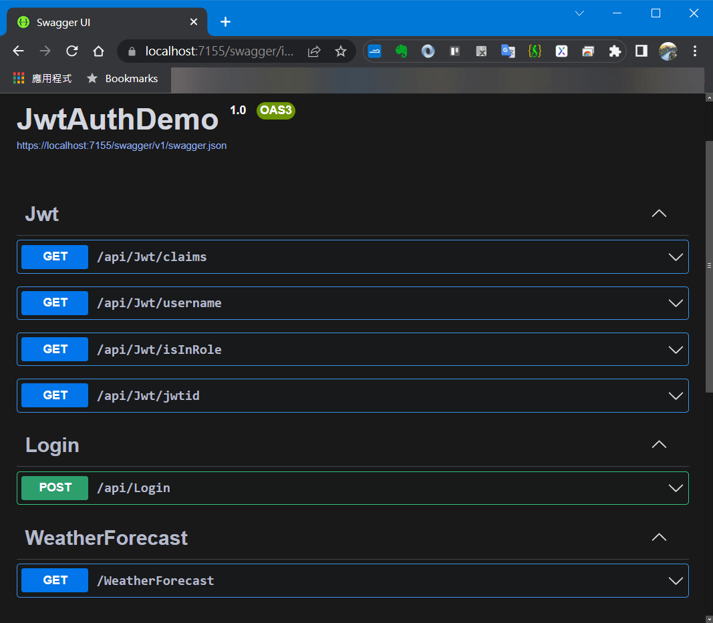

(4) 以 Postman 取 token  
<a href="https://localhost:7155/api/Login/signin" target="_blank">https://localhost:7155/api/Login/signin</a>  
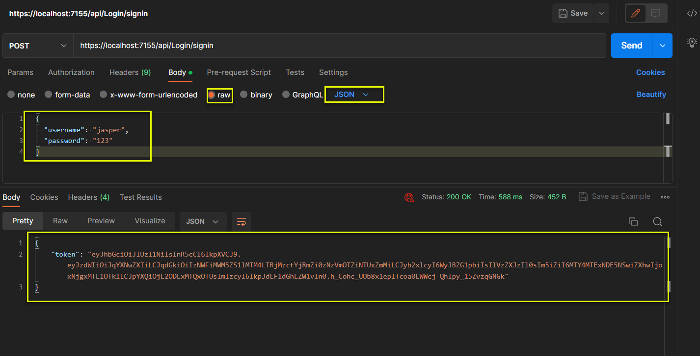

(5) 以 Postman 取 claims  
出現 Unsupported Media Type 錯誤, 經偵錯, 發現在未進入 controller/action 前就已出錯.

```plaintext
{
    "type": "https://tools.ietf.org/html/rfc7231#section-6.5.13",
    "title": "Unsupported Media Type",
    "status": 415,
    "traceId": "00-541e9239328ac0745b0c09fbb0d8e619-cd5a96a5d2ad030c-00"
}
```

```csharp
/// <summary>
/// 取得 JWT Token 中的所有 Claims
/// </summary>
/// <returns></returns>
//[HttpGet(Name = nameof(GetClaims))]
[HttpGet("claims")]
public IActionResult GetClaims(ClaimsPrincipal user)
{
    return Ok(user.Claims.Select(p => new { p.Type, p.Value }));
}
```

上述的程式段看來, 原本在 Minimal API 採屬性注入 ClaimsPrincipal 物件至 endpoint.   
在 Controller/Action API 的環境下, 似乎無法這樣作; 經查文件, ControllerBase 有一個 User property 可用. 調整一下, 看來 OK 了.  

```csharp
/// <summary>
/// 取得 JWT Token 中的所有 Claims
/// </summary>
/// <returns></returns>
//[HttpGet(Name = nameof(GetClaims))]
[HttpGet("claims")]
public IActionResult GetClaims()
{
    return Ok(User.Claims.Select(p => new { p.Type, p.Value }));
}
```

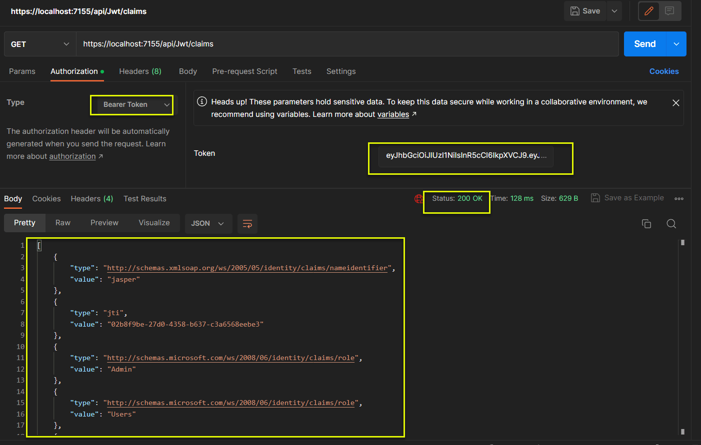

## 4. 完整測試截圖 

### 4.1 Postman 測試截圖

(1) GetToken:  


(2) GetAllClaims:  


(3) GetUserName:  
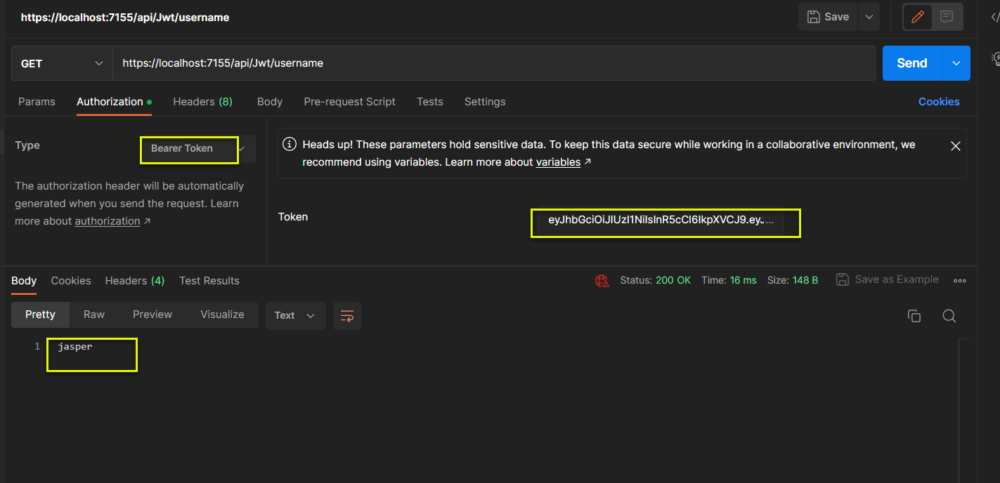

(4) GetJwtId:  
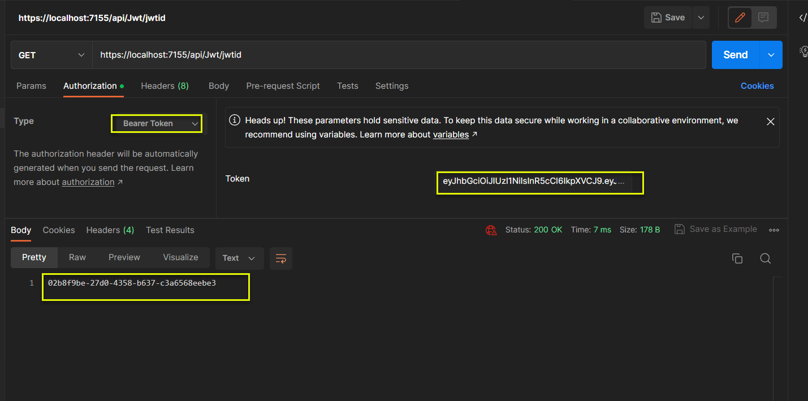

(5) IsInRole:  
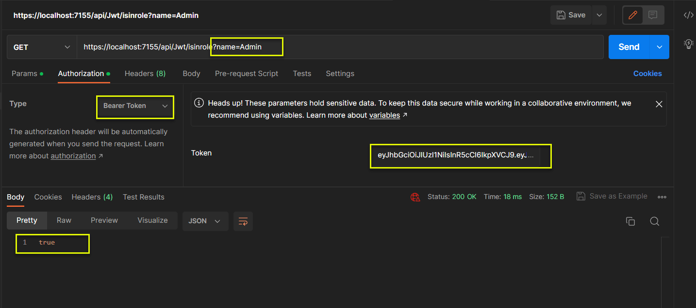

### 4.2 Postman 環境設定

(1) 下圖共設定了 3 個環境變數 (host, port, jwt_token)
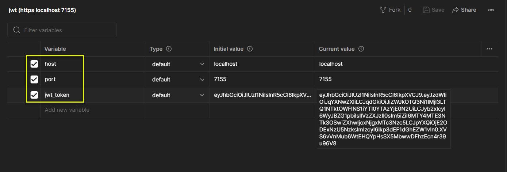

(2) 下圖將前述 3 個變數, 應用到各個 HTTP Request  
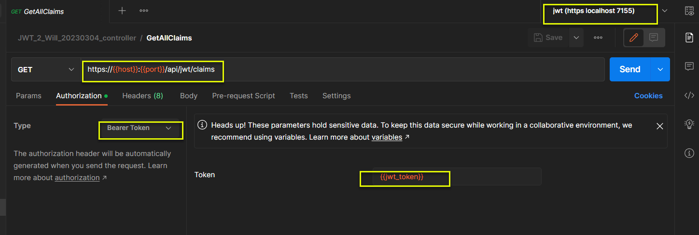

## 5. 參考文件

* <a href="https://blog.miniasp.com/post/2022/02/13/How-to-use-JWT-token-based-auth-in-aspnet-core-60" target="_blank">(Will保哥) 如何在 ASP.NET Core 6 使用 Token-based 身份認證與授權 (JWT)</a>  

* <a href="https://5xruby.tw/posts/what-is-jwt" target="_blank">(五倍紅寶石) 是誰在敲打我窗？什麼是 JWT ？</a>

* <a href="https://blog.darkthread.net/blog/libman-in-vs2017/" target="_blank">(小碼農米爾) [C#][ASP.NET] Web API 開發心得 (7) - 使用 Token 進行 API 授權驗證</a>

* <a href="https://mgleon08.github.io/blog/2018/07/16/jwt/" target="_blank">JSON Web Token(JWT) 簡單介紹</a>  

* <a href="https://www.youtube.com/watch?v=RWedxdSRrjk&list=PL1Nml43UBm6ctQsHH6eSWtQmMBqRiS2mI&index=4" target="_blank">(影片) JWT iss vs aud claim</a>  
> iss (issuer)(發行者): 後端 web api provider (ex: https://backend.webapi.com)  
> aud (audiance)(接收者): 前端 web api consumer (ex: https://frontend.webapi.com)  

* <a href="https://stackoverflow.com/questions/74256233/iactionresult-vs-iresult-asp-net-core" target="_blank">(StackOverflow) IActionResult vs IResult ASP.NET Core</a>  
> **IActionResult** is part of the MVC framework. It is found in Microsoft.AspNetCore.Mvc namespace in the Microsoft.AspNetCore.Mvc.Abstractions.dll library.  
> **IResult** is part of the new API framework introduced as part of .NET 6.0. It is found in the Microsoft.AspNetCore.Http namespace in the Microsoft.AspNetCore.Http.Abstractions.dll library. IResult is fully supported with the new minimal APIs features of .NET 6.0+.  
> **When should I use one vs the other?**  
If you are working with an MVC-based API controller, you should consider using IActionResult (or the base ActionResult class, if desired).    
If you are writing APIs without MVC using .NET 6.0+, either using the Minimal API framework or something else, you should consider using IResult.    

* <a href="https://stackoverflow.com/questions/686217/maximum-on-http-header-values" target="_blank">(StackOverflow) Maximum on HTTP header values?</a>  
> HTTP does not define any limit. However most web servers do limit size of headers they accept. For example in **Apache default limit is 8KB**, in **IIS it's 16K**. Server will return 413 Entity Too Large error if headers size exceeds that limit.

* <a href="https://www.tutorialspoint.com/What-is-the-maximum-size-of-HTTP-header-values" target="_blank">(TutorialPoint)(Nancy Den) What is the maximum size of HTTP header values?</a>  
> | Web Server | Size Limit |
| --- | --- |
| Apache | 8K |
| Nginx | 4K-8K |
| IIS | 8K-16K |
| Tomcat | 8K – 48K |


* 以下為自行補充:  
  * sub (subject)(主體): 存放使用者的 ID  
  * nbf (not before)(在那個時間點以前不可使用該token): 實作上會轉成秒數  
  * iat (issue at)(簽發token的時間): 實作上會轉成秒數  
  * exp (expiration)(token何時失效): 實作上會轉成秒數  
  * jti (jwt id)(token的唯一編號): 實作上會採用 GUID  
  * 關於時間處理的程式段及執行果如下:  
```csharp
Console.WriteLine(DateTimeOffset.UtcNow);
Console.WriteLine(DateTimeOffset.UtcNow.ToUnixTimeSeconds().ToString());
Console.WriteLine(DateTimeOffset.UtcNow.AddMinutes(10).ToUnixTimeSeconds().ToString());
Console.WriteLine(DateTimeOffset.UtcNow.AddMinutes(30).ToUnixTimeSeconds().ToString());
Console.WriteLine(Guid.NewGuid().ToString());
```
```plaintext
2023/3/28 上午 09:15:26 +00:00
1679994926
1679995526
1679996726
8cb2a934-1347-4454-b999-35a2a12ccfc0
==> 1679995526 - 1679994926 =   600 seconds = 10 minutes
==> 1679996726 - 1679994926 = 1,800 seconds = 30 minutes
```

